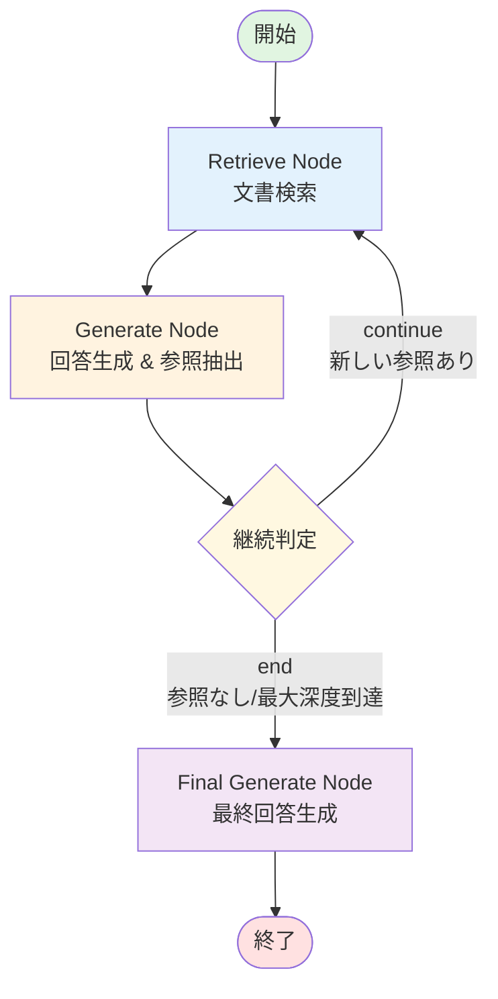
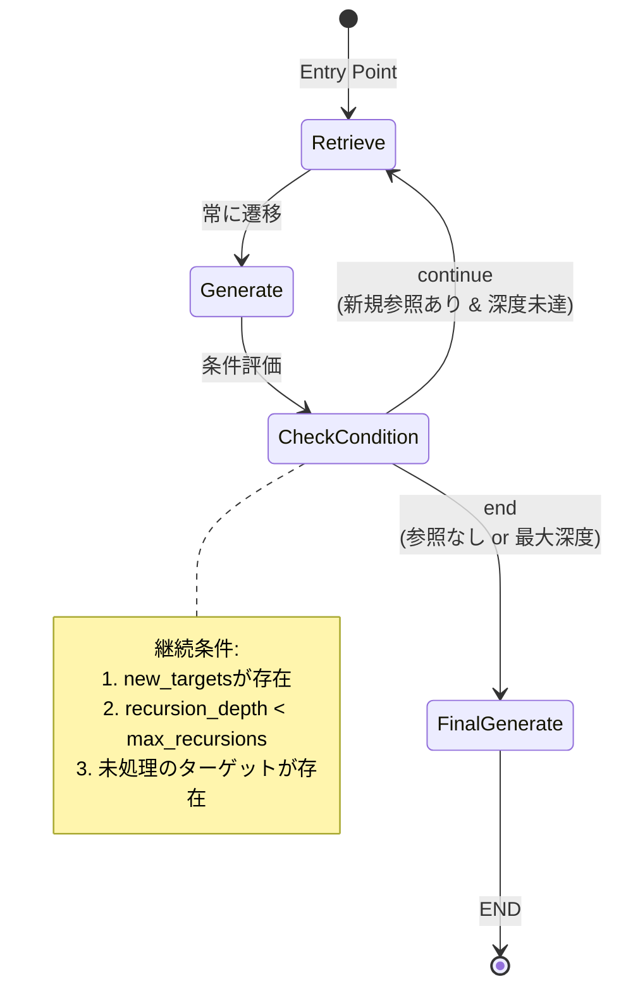

# CRAG - Corrective RAG System

## 概要
CRAG (Corrective Retrieval Augmented Generation) は、再帰的な情報検索と生成を行う高度なRAGシステムの実装です。通常のRAGシステムを拡張し、取得した文書内の参照を追跡して追加検索を行うことで、より包括的で正確な回答を生成します。

## プロジェクト構成

### 主要ファイル
- **crag.py** - 再帰的RAGシステムのコア実装（LangGraphベース）
- **app.py** - Azure OpenAIを使用したStreamlitチャットインターフェース
- **requirements.txt** - プロジェクトの依存パッケージ一覧

## 機能

### 1. 再帰的RAGシステム (crag.py)
- **自動参照追跡**: 取得した文書内のURL・文書参照を自動検出
- **多段階検索**: 参照先を再帰的に検索し、関連情報を収集
- **深度制限**: 無限ループを防ぐ再帰深度の制御
- **統合生成**: 収集した全情報を統合した包括的な回答生成

### 2. Streamlit チャットUI (app.py)
- **Azure OpenAI統合**: Azure上のGPTモデルとの連携
- **高度な表示機能**:
  - Markdownフォーマット対応
  - コードブロックの自動検出とハイライト
  - 見出し・リストの整形表示
- **カスタマイズ可能なテーマ**: コードテーマの選択機能

## 技術スタック

### コア技術
- **LangChain**: RAGパイプラインの構築
- **LangGraph**: 状態管理型のワークフロー実装
- **ChromaDB**: ベクトルデータベース
- **Google Generative AI**: エンベディングとLLM（Gemini）

### UI技術
- **Streamlit**: Webアプリケーションフレームワーク
- **Azure OpenAI**: チャット機能のLLMバックエンド

## セットアップ

### 1. 依存関係のインストール
```bash
pip install -r requirements.txt
```

### 2. 環境変数の設定
プロジェクトルートに `.env` ファイルを作成:

```env
# Google AI APIキー (crag.py用)
GOOGLE_API_KEY=your_google_api_key

# Azure OpenAI設定 (app.py用) 
AZURE_OPENAI_ENDPOINT=https://your-endpoint.openai.azure.com/
AZURE_OPENAI_API_KEY=your_api_key
AZURE_OPENAI_API_VERSION=2024-12-01-preview
AZURE_OPENAI_DEPLOYMENT_NAME=your_deployment_name
```

## 使用方法

### 再帰的RAGシステムの実行
```python
from crag import run_recursive_rag

question = "RAGシステムの仕組みとベクトルデータベースの選定について教えてください。"
result = run_recursive_rag(question, max_recursions=3)
print(result["answer"])
```

### Streamlitアプリの起動
```bash
streamlit run app.py
```

## システムアーキテクチャ

### LangGraphフロー図



### ノードの詳細

| ノード | 責務 | 入力 | 出力 |
|--------|------|------|------|
| **Retrieve Node** | ベクトルストアから関連文書を検索 | クエリ（初回は質問、以降は参照） | 取得した文書をdocumentsに追加 |
| **Generate Node** | 取得文書から回答生成と新規参照を抽出 | 質問と文書 | new_targets（新規参照）とprocessed_targets |
| **Final Generate Node** | 全文書を統合して最終回答を生成 | 質問と全文書 | 最終的な回答 |

### エッジと条件分岐



### CRAGワークフロー
1. **初期検索**: ユーザーの質問に基づく文書取得
2. **参照抽出**: 取得文書からURL・文書参照を抽出
3. **再帰検索**: 参照先の追加情報を検索（条件に応じて繰り返し）
4. **統合生成**: 全情報を統合した最終回答の生成

### 状態管理
```python
GraphState = {
    "question": str,           # ユーザーの質問
    "documents": List[str],    # 収集された文書
    "recursion_depth": int,    # 現在の再帰深度
    "max_recursions": int,     # 最大再帰深度
    "processed_targets": List, # 処理済みターゲット
    "new_targets": List,       # 新規ターゲット
    "answer": str             # 最終回答
}
```

## カスタマイズ

### 再帰深度の調整
```python
# デフォルト: 2段階
result = run_recursive_rag(question, max_recursions=5)
```

### サンプル文書の追加
crag.pyの`sample_documents`リストに新しいDocumentオブジェクトを追加:
```python
Document(
    page_content="文書の内容",
    metadata={"source": "ソース名"}
)
```

## 注意事項
- APIキーは必ず環境変数または.envファイルで管理
- 大量の再帰検索はAPI使用量に影響するため注意
- ChromaDBは開発環境ではインメモリで動作

## トラブルシューティング

### よくある問題
1. **APIキーエラー**: .envファイルの設定を確認
2. **依存関係エラー**: `pip install -r requirements.txt`を再実行
3. **メモリ不足**: 再帰深度を減らす

## ライセンス
このプロジェクトは研究・開発目的で提供されています。